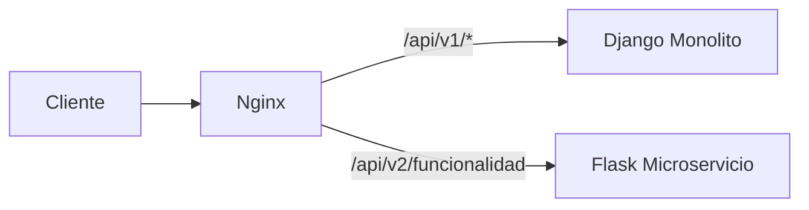

# Migracion a Microservicios (Strangler Pattern)

## Matriz de decision
| Modulo | Frecuencia de cambio | Consumo de recursos | Acoplamiento | Puntaje total |
|---|---|---|---|---|
| Registro/Login | Medio | Bajo | Alto con modelos de cliente | 2 |
| Creacion de citas | Alto | Medio | Alto (cliente, barbero, horario, servicio) | 3 |
| Cotizacion de tipo de servicio | Alto | Bajo | Bajo | 5 |

Decision: Se estrangula Cotizacion de tipo de servicio por tener bajo acoplamiento y alta facilidad de extraccion.

## Separacion tecnica
- Monolito Django mantiene rutas legacy en /api/v1/.
- Microservicio Flask recibe la nueva funcionalidad en /api/v2/funcionalidad.
- Nginx actua como punto unico de entrada y enruta por path.

## Topologia
- Cliente -> Nginx
- Nginx -> Django para /api/v1/*
- Nginx -> Flask para /api/v2/funcionalidad

## Diagrama mermaid

## Manejo de errores en Flask
- 400 cuando faltan campos o tipos invalidos.
- 500 para errores no controlados.
